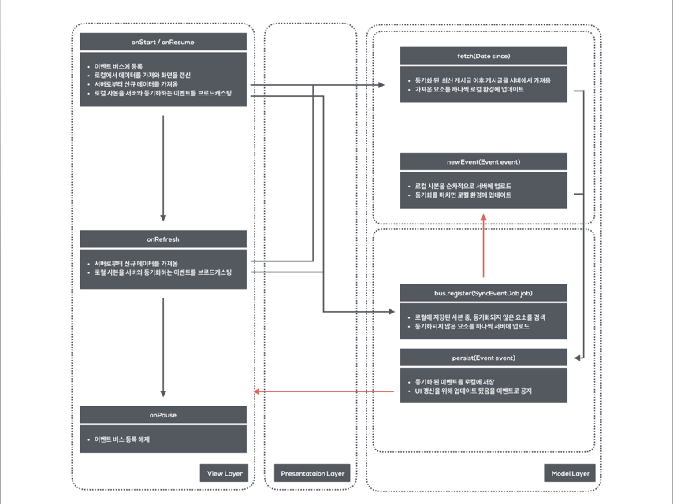

## App architecture demo inspired by "Offline Design" from Google.
[시연 영상][demo_video_link]

간단하게 사진과 위치 정보, 현재의 기분 상태를 익명으로 공유할 수 있는 샘플 애플리케이션입니다.

본 애플리케이션은 불안정한 네트워크 환경에서도 유연하게 대처할 수 있는 사용자 경험을 제공하기 위해 오프라인 환경을 활용하고 서버와 동기화하는 구조를 채택하였습니다.

### 레퍼런스

- 구조를 작성하기 위해 [Yigit Boyar](yigit_social_link)가  [Google I/O 2016](io_link) 와 [Android Dev Summit 2015](dev_summit_link)에서 발표한 내용을 참고했습니다.

- 위의 내용을 구현한 [소스 코드](yigit_github_link)의 구성을 참고했으나, 버그와 관련된 PR이 반영되지 않고 있으며 새로운 내용을 적용하고자 별도의 프로젝트를 구성했습니다.


### 적용된 내용

- MVP 패턴과 불안정한 네트워크 환경을 고려한 아키텍쳐 적용
- RxAndroid에 의한 스케쥴링
- 작업 큐와 이벤트 버스를 걷어내고 RxAndroid를 활용하여 이를 대체
- RxAndroid에서 제공하는 인터페이스로 Retrofit2와 Realm를 관리
- Dagger2에 의한 의존성 주입
- 데이터바인딩 라이브러리에 의한 뷰 상태 관리

### 오프라인 디자인

- 클라이언트에서 게시글을 생성할 때, `UUID.randomUUID()`를 사용하여 고유 ID를 부여합니다.
- 기본적으로는 UUID가 고유한 값을 가지나, 중복이 발생하는 경우에 대응하는 전략으로 다음 중 하나를 선택할 수 있습니다.

    - 고유 ID를 새로 발급합니다.
    - 회원 정보를 만들어 관리하는 경우에 한하여 (회원 ID, 게시글 ID)를 복합 식별 키로 사용합니다.


- 게시글을 작성하면 우선 내용을 로컬 환경에 저장하고 서버와 통신하는 과정을 비동기로 진행합니다.
- 서버와의 통신이 마무리되면 게시글이 동기화되었음을 로컬에도 알리고 UI도 업데이트 합니다.
- 동기화의 여부를 저장하고 UI에 표현하기 위해서는 모델 객체에 이를 위한 플래그가 선언되어야 합니다.
- 동기화에 실패할 경우 다음 두 가지 전략을 취할 수 있습니다. 본 샘플에서는 후자의 방식을 사용했습니다.

    - 동기화에 성공할 때까지 여러 번 재시도합니다.
    - 사용자에게 동기화에 실패했음을 알리고 로컬에서 제거합니다.


- 서비스와 다루는 데이터의 특성에 따라, 위에서 언급했던 전략을 선택적으로 적용하거나 응용하여 구현 가능합니다.

### 아키텍쳐 레이어 구성도




### 동작 원리

#### 데이터 바인딩 라이브러리

- 중요한 핵심은 XML 상에서 뷰의 상태를 관리하고 표현하며, 외부 함수를 호출할 수 있다는 점입니다.

    - XML상에 변수와 레이아웃을 나눠 구성하고 레이아웃에서 변수를 참조하여 뷰를 표현합니다.
    - 기존의 자바 코드를 활용할 수 있습니다.
    - XML 파일을 읽고 이를 기반으로 코드를 생성하는 형태로 라이브러리가 구현됩니다.


- `findByView(int id)`가 생략됩니다.
- `setOnClickListener(...)`과 같은 기본적인 콜백을 XML에서 등록할 수 있습니다.
- 부분적으로 람다 표현식에 의한 콜백 코드를 지원합니다.
- 제한적으로 `Two-way 바인딩`을 지원합니다.
- XML 속성을 재정의할 수 있습니다.


#### RxAndroid

- 개요

    - 옵저버 패턴과 함수형 프로그래밍 개념을 확장하여 반응형으로 서비스를 제작할 수 있도록 한 ReactiveX의 구현체 중 하나입니다.
    - 데이터가 흐르는 스트림인 Observable과 여기에 흐르는 데이터를 관측하는 Subscriber로 구성됩니다.
    - Subject는 Observable의 형태 중 하나로, 이벤트를 받아 등록된 Subscriber에게 전달합니다.
    - 함수형 프로그래밍의 패러다임을 계승했기 때문에, 순수 함수의 조합을 통해 새로운 Observable을 얻을 수 있습니다.
    - 옵저버 패턴을 기반으로 작성되었기 때문에 애플리케이션의 흐름이 단순해집니다.
    - 안드로이드에 특화된 기능이 스케쥴링 기능을 활용할 수 있으며, [RxBindng](),[RxLifecycle]()과 결합하여 사용하기도 합니다.


- 작업 큐

    - ReactiveX의 근간을 이루는 스트림이라는 개념 자체가 데이터를 순차적으로 흘려보내는 역할을 합니다.
    - 이런 특성을 잘 활용하면 작업 큐의 역할을 충분히 수행할 수 있습니다.
    - 인터페이스를 통일하기 위해 대체하였으나, 기존의 [작업 큐](job_queue_github_link)가 여러 기능을 제공하므로 같이 사용하는 방안도 고려할 수 있습니다.

        - 작업별 우선순위 설정
        - 작업 실 패시 재시도
        - 작업 정보를 로컬에 저장
        - 네트워크 상태 감지


- 이벤트 버스

    - 서로 직접적으로 간섭할 수 없는 요소들에게 `인터페이스 - 버스`를 제공하고 어떤 이벤트 정보를 흘려보내면 선택적으로 수신할 수 있는 메커니즘을 의미합니다.
    - 클래스의 타입이나 속성으로 이벤트의 유형을 정의하고 필터링 된 신호를 `Observable.onNext(...)`로 등록된 콜백으로 흘려보냅니다.
    - RxAndroid의 함수형 프로그래밍 지원으로 데이터를 가공할 수 있는 장점 등을 이유로 대체하였습니다.
    - 이벤트 버스를 사용하면 컴포넌트간 관계를 쉽게 맺을 수 있고 복잡한 생명주기 이슈를 피할 수 있습니다.
    - 그러나 대부분 이벤트를 수신하는 함수의 선언으로만 구성되어 흐름을 파악하기 어렵습니다.
    - RxAndroid로 명시적으로 구독에 대한 정보를 보관함으로써, 가독성에 대한 문제를 해결하고자 했습니다.


```java

private final Subject<Object, Object> bus = new SerializedSubject<>(PublishSubject.create());

public <T> Subscription register(final Class<T> type, Action1<T> onNext) {

    return bus
            .filter(new Func1<Object, Boolean>() {

                @Override
                public Boolean call(Object o) { return o.getClass().equals(type); }
            })
            .map(new Func1<Object, T>() {

                @SuppressWarnings("unchecked")
                @Override
                public T call(Object o) { return (T) o; }
            })
            .subscribe(onNext);
}

public void post(Object event) {

    bus.onNext(event);
}

```


### 실행 방법

#### 안드로이드

- 로컬 서버를 사용하며 기본 설정 (http://10.0.2.2:3000/) 을 사용하여 서버에 접속합니다.
- 위치 정보를 가져오기 위해 [Place Picker](place_picker_link)를 사용했으며, 이를 활성화하기 위해 별도의 API 키를 등록해야 합니다.
- 프로젝트를 생성해 키를 등록하고 이를 AndroidManifest.xml에 추가합니다.

```
> cd ./daily-android/Daily/app/src
```

```xml

<meta-data
    android:name="com.google.android.geo.API_KEY"
    android:value="API 키 입력"/>

```

#### 서버

- [Node.js](nodejs_link) 및 [MySQL](mysql_link)이 설치되어 있어야 합니다.
- Node / NPM Version : v5.4.1 / 3.10.7
- MySQL Version : 5.7.10

```
> cd ./daily-backend
> npm install
> npm start
```

### 네트워크 상황에 대한 시뮬레이션

- 네트워크 불안정 : AVD의 확장 컨트롤을 열고 'Celluar > Data Status'를 'Denied'로 변경합니다.
- 서버 불안정 : 서버를 종료하여 서비스가 정상적으로 제공되지 않는 상황을 재현합니다.

### TODO

- 서버와의 연결이 실패했을 때, 상태를 주기적으로 체크하여 동기화
- 테스트 코드 작성

### Thanks to

- [Realm](realm_link)
- [Retrofit2](retrofit2_link)
- [Picasso](picasso_link)
- [RxAndroid](rxandroid_link)

### License

```
Copyright (C) 2015 The Android Open Source Project

Licensed under the Apache License, Version 2.0 (the "License");
you may not use this file except in compliance with the License.

You may obtain a copy of the License at
 http://www.apache.org/licenses/LICENSE-2.0

Unless required by applicable law or agreed to in writing, software
distributed under the License is distributed on an "AS IS" BASIS,
WITHOUT WARRANTIES OR CONDITIONS OF ANY KIND, either express or implied.

See the License for the specific language governing permissions and
limitations under the License.
```

[demo_video_link]:https://www.youtube.com/watch?v=DEqFWun40k4
[io_link]:https://www.youtube.com/watch?v=70WqJxymPr8
[dev_summit_link]:https://www.youtube.com/watch?v=BlkJzgjzL0c
[yigit_social_link]:https://twitter.com/yigitboyar
[yigit_github_link]:https://github.com/yigit/dev-summit-architecture-demo
[rxbinding_link]:https://github.com/JakeWharton/RxBinding
[rxlifecycle_link]:https://github.com/trello/RxLifecycle
[job_queue_github_link]:https://github.com/yigit/android-priority-jobqueue
[place_picker_link]:https://developers.google.com/places/android-api/placepicker
[nodejs_link]:https://nodejs.org/
[mysql_link]:http://www.mysql.com/
[realm_link]:https://realm.io/
[retrofit2_link]:https://square.github.io/retrofit/
[picasso_link]:http://square.github.io/picasso/
[rxandroid_link]:https://github.com/ReactiveX/RxAndroid
